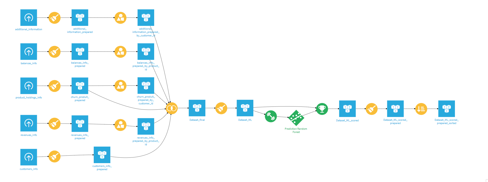
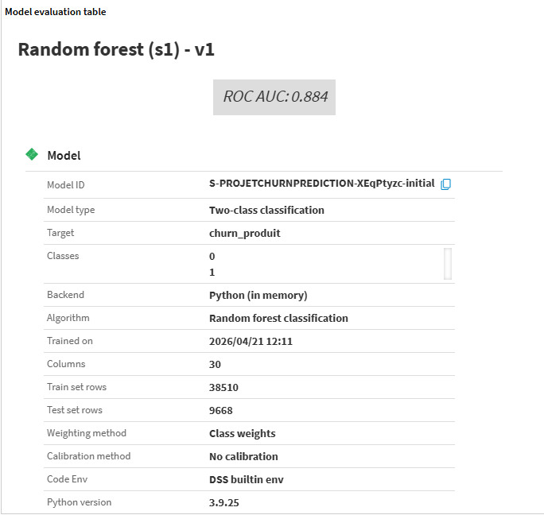
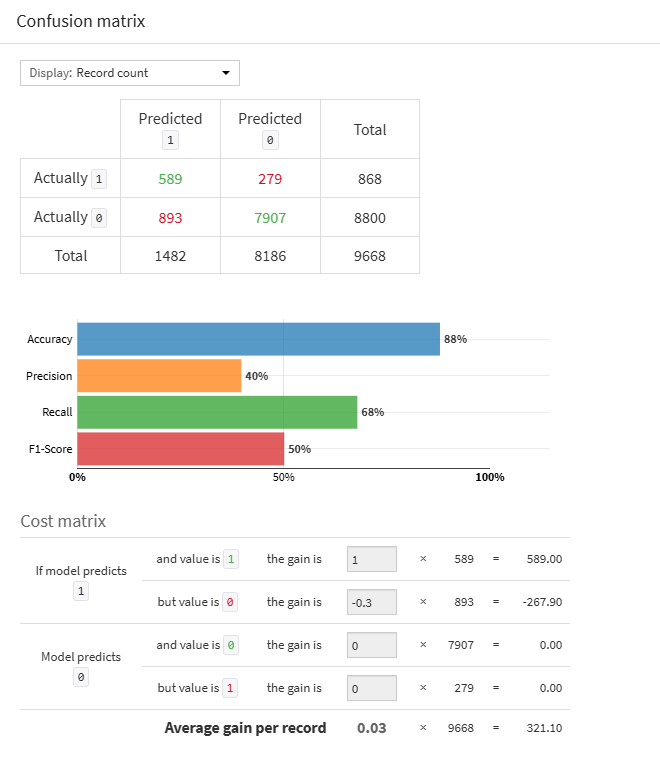
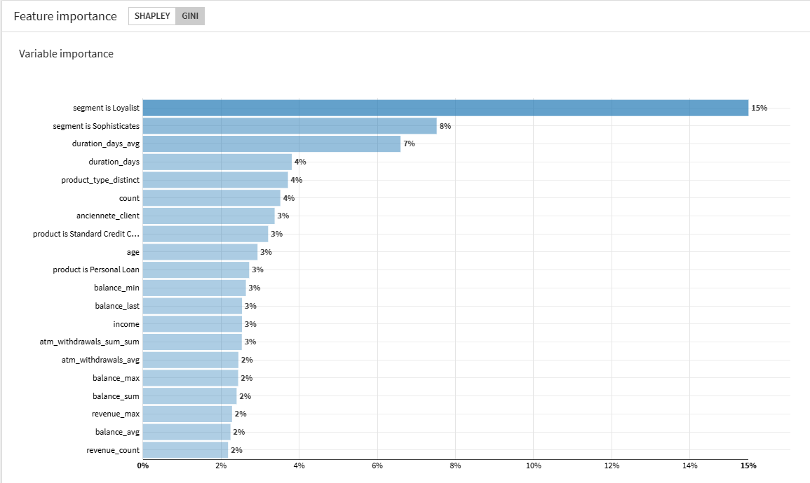
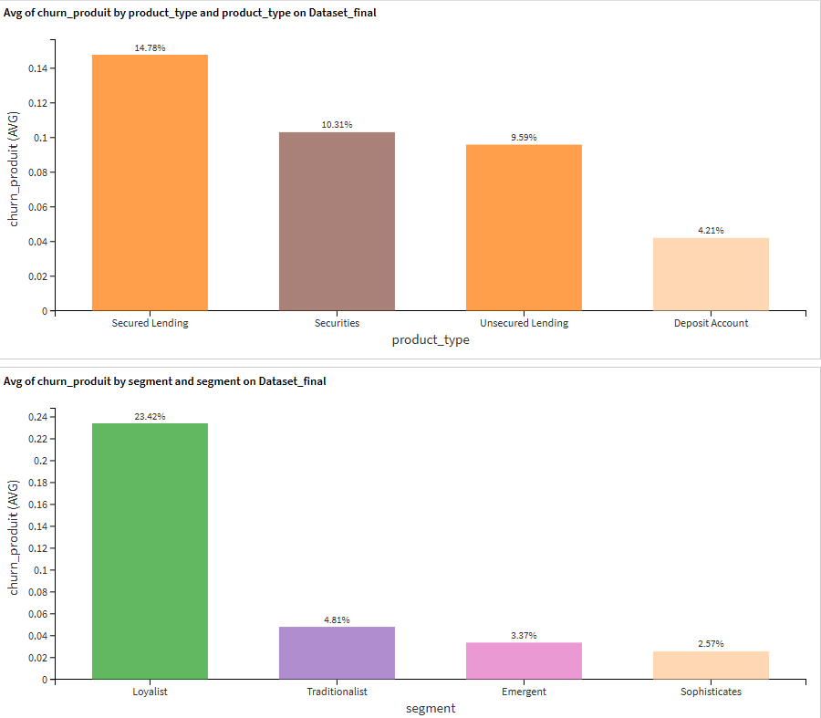
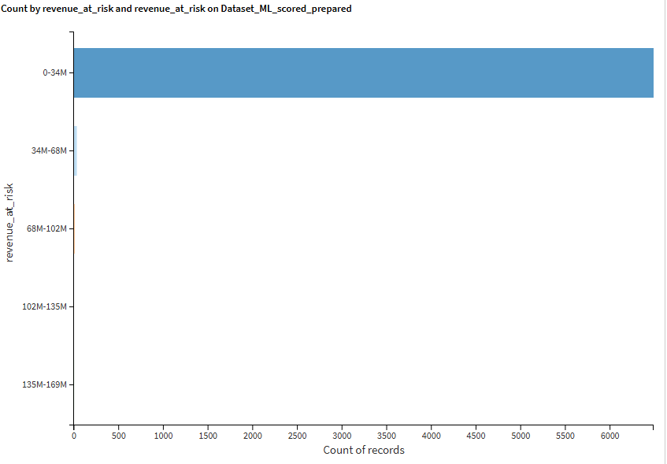

# 🏦 Churn Prediction – Banque de Détail (Dataiku)

Modèle de Machine Learning pour anticiper le départ des clients 
d'une banque de détail et permettre une intervention proactive 
sur les clients à risque.

## 🎯 Problématique
Une banque de détail cherche à anticiper le départ de ses clients 
en analysant leur comportement historique, leurs revenus et leur 
utilisation des produits. L'objectif est de prédire le risque de 
désabonnement au niveau client et produit afin de fidéliser les 
clients les plus rentables et réduire la perte de revenus.

## 📊 Aperçu du Flow Dataiku

## 🔄 Pipeline ML
5 datasets sources
↓
Préparation & nettoyage
↓
Feature Engineering
↓
Modélisation – Random Forest
↓
Évaluation & scoring
↓
Clients à risque identifiés
## 📁 Datasets d'entrée

| Dataset | Description | Granularité |
|---------|-------------|-------------|
| `revenues_info` | Revenus générés par produit par client | 1 ligne = 1 transaction |
| `product_holdings_info` | Produits souscrits et durée de détention | 1 ligne = 1 produit client |
| `customers_info` | Informations statiques client (nom, tier, date création) | 1 ligne = 1 client |
| `balances_info` | Soldes par produit par client dans le temps | 1 ligne = 1 solde à une date |
| `additional_information` | Événements comportementaux client | 1 ligne = 1 événement |

> Les datasets `revenues_info`, `product_holdings_info` et `balances_info` 
> couvrent la même période et ont la même fréquence temporelle.

## 🧠 Features clés utilisées
- **Revenus** : revenus générés par produit (`date`, `product_id`, `revenue`)
- **Produits** : type, date de souscription et fin (`product_type`, `start_date`, `end_date`)
- **Profil client** : ancienneté, tier (GOLD…), date de naissance
- **Soldes** : évolution des soldes dans le temps
- **Comportement** : interactions, retraits ATM, événements optionnels

## 🤖 Modèle
| Paramètre | Détail |
|-----------|--------|
| Algorithme | Random Forest (classification) |
| Cible | Churn (0 = fidèle, 1 = départ) |
| Outil | Dataiku DSS |
| Langage | Python · Scikit-learn |

## 🎯 Résultats

## 🛠️ Outils utilisés
Dataiku DSS · Python · Random Forest · Scikit-learn · Pandas

## 📁 Structure du projet
├── screenshots/        → Flow et visualisations Dataiku
├── notebooks/          → Analyse exploratoire
├── recipes/            → Recettes de préparation et modélisation
└── data/               → Schéma des données (data_description.pdf)